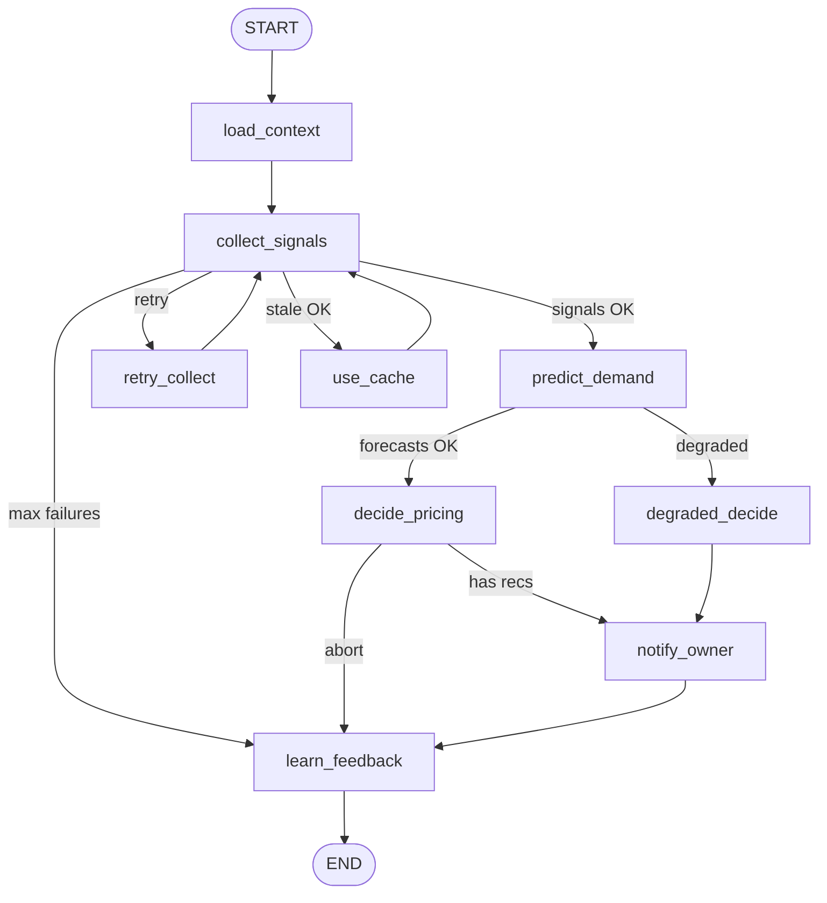

# PricePulse Autonomous AI Pricing Agent (LangGraph)

## Responsibilities

| # | Stage | Node | Output |
|---|--------|------|--------|
| 1 | Collect Signals | `collect_signals` | `SignalBundle` (weather, footfall, news, events, sales) |
| 2 | Predict Demand | `predict_demand` | `DemandForecast[]` per product |
| 3 | Decide Pricing | `decide_pricing` | `PricingRecommendation[]` |
| 4 | Notify Owner | `notify_owner` | WhatsApp / persisted `recommendations` |
| 5 | Learn from Feedback | `learn_feedback` | Updated `FeedbackSnapshot` + Redis run log |

## LangGraph Workflow



## State Definition

Core type: `PricingAgentState` (`backend/agent/state.py`)

| Field | Type | Reducer | Description |
|-------|------|---------|-------------|
| `run_id` | str | replace | Unique run identifier |
| `business_id` | UUID | replace | Tenant / business |
| `location_id` | UUID | replace | Store location |
| `signals` | `SignalBundle` | replace | Aggregated external inputs |
| `forecasts` | `DemandForecast[]` | replace | Demand index 0–2 per product |
| `recommendations` | `PricingRecommendation[]` | **append** | Agent outputs |
| `errors` | `AgentError[]` | **append** | Recoverable failures |
| `feedback` | `FeedbackSnapshot` | replace | Owner preference learning |
| `retry_count` | int | replace | Recovery counter |

### Recommendation types (outputs)

| Type | When generated |
|------|----------------|
| `discount` | `demand_index < 0.85` |
| `price_increase` | `demand_index > 1.15` |
| `happy_hour` | Footfall `busy_percent < 35` |
| `bundle` | Local event attendance ≥ 1000 + beverage catalog |

## Tool Design

Tools live in `backend/agent/tools/` and are **idempotent** and **soft-failing** (`{ok, data}` / `{ok, error}`).

| Tool | Input | Source | Purpose |
|------|-------|--------|---------|
| `fetch_weather` | lat, lon | OpenWeatherMap | Temperature, condition |
| `fetch_footfall` | lat, lon | Google Popular Times* | `busy_percent`, `visitor_index` |
| `fetch_news` | city | NewsAPI | Local sentiment headlines |
| `fetch_events` | lat, lon | PredictHQ | Attendance, category, time window |
| `fetch_sales_history` | business_id, session | PostgreSQL | 30-day units / avg price |
| `persist_recommendations` | recs, catalog | PostgreSQL | Maps to `recommendations` table |
| `send_owner_notification` | phone, recs | Twilio WhatsApp | Owner alert |
| `load_feedback_memory` | business_id | PG + Redis | Discount cap tuning |
| `record_run_outcome` | run_id, outcome | Redis | Run history list |

\*Mock when `GOOGLE_MAPS_API_KEY` unset.

### Parallel signal collection

`collect_signals` uses `asyncio.gather` for weather, footfall, news, and events; sales history runs synchronously on the DB session.

## Memory Architecture

```
┌─────────────────────────────────────────────────────────┐
│  Tier 1 — Working memory (LangGraph state)              │
│  Single run: signals, forecasts, recommendations        │
└─────────────────────────────────────────────────────────┘
                          │
                          ▼
┌─────────────────────────────────────────────────────────┐
│  Tier 2 — Session memory (Redis)                        │
│  agent:signals:{business}:{location}  TTL 15 min          │
│  agent:feedback:{business}             discount cap profile │
│  agent:runs:{business}                 last 100 run logs    │
└─────────────────────────────────────────────────────────┘
                          │
                          ▼
┌─────────────────────────────────────────────────────────┐
│  Tier 3 — Long-term memory (PostgreSQL)                 │
│  recommendations (approve/reject), sales_history, audit   │
└─────────────────────────────────────────────────────────┘
```

Learning loop: rejected recommendations lower `preferred_discount_cap_pct` in Redis; `decide_pricing` respects this cap.

## Error Recovery Flow

| Failure | Strategy | Graph route |
|---------|----------|-------------|
| Single API down | Partial `SignalBundle`; continue | `continue` |
| All APIs down | Retry up to `AGENT_MAX_RETRIES` | `retry_collect` |
| Retry exhausted | Use Redis cached signals | `use_cache` |
| Cache miss + no signals | Degraded default discount | `degraded_decide` |
| No recommendations after decide | Skip notify, still learn | `abort` → `learn_feedback` |

Configuration: `AGENT_MAX_RETRIES` (default 3), `AGENT_SIGNAL_CACHE_TTL_SECONDS` (default 900).

## Running the Agent

```python
from uuid import UUID
from backend.agent.graph import run_pricing_agent

result = run_pricing_agent(business_id=UUID("..."), triggered_by="api")
```

### Celery

```bash
# Single tenant
celery -A backend.workers.celery_app.celery_app call backend.workers.tasks.run_autonomous_pricing_agent --args='["<tenant-uuid>"]'

# All tenants (add to beat schedule)
backend.workers.tasks.periodic_pricing_agent_run
```

## Environment Variables

| Variable | Purpose |
|----------|---------|
| `OPENWEATHER_API_KEY` | Weather tool |
| `PREDICTHQ_API_KEY` | Events tool |
| `NEWS_API_KEY` | News tool |
| `GOOGLE_MAPS_API_KEY` | Footfall tool |
| `TWILIO_*` | Owner notifications |
| `OPENAI_API_KEY` | Optional future LLM reasoning layer |
| `AGENT_MAX_RETRIES` | Recovery limit |

## File Layout

```
backend/agent/
  state.py          # State + Pydantic models
  graph.py          # LangGraph compile + invoke
  memory.py         # Redis session store
  recovery.py       # Routing + retry logic
  nodes/            # One file per pipeline stage
  tools/            # External I/O tools
  AGENT.md          # This document
```
